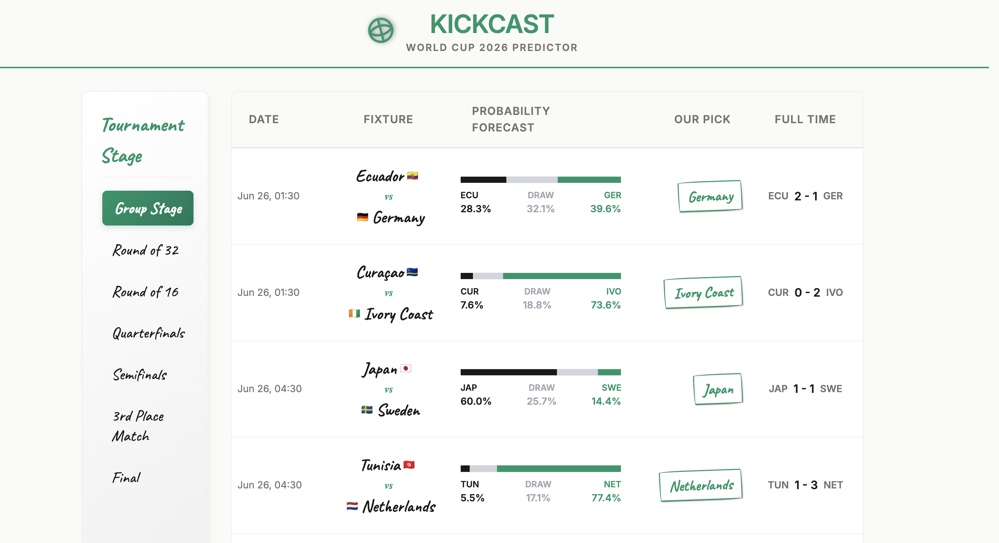
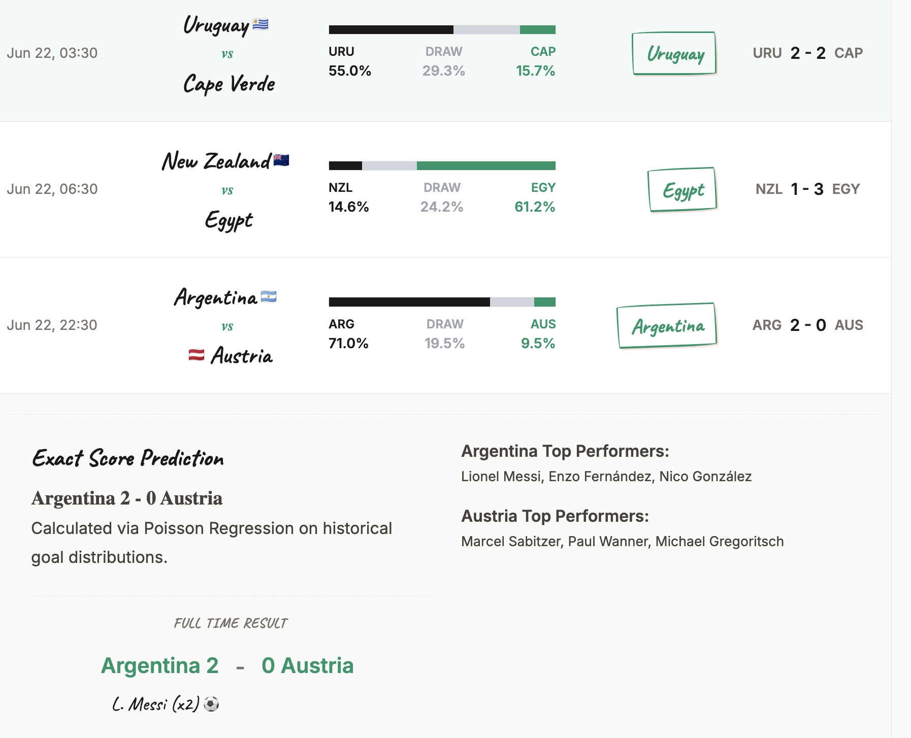
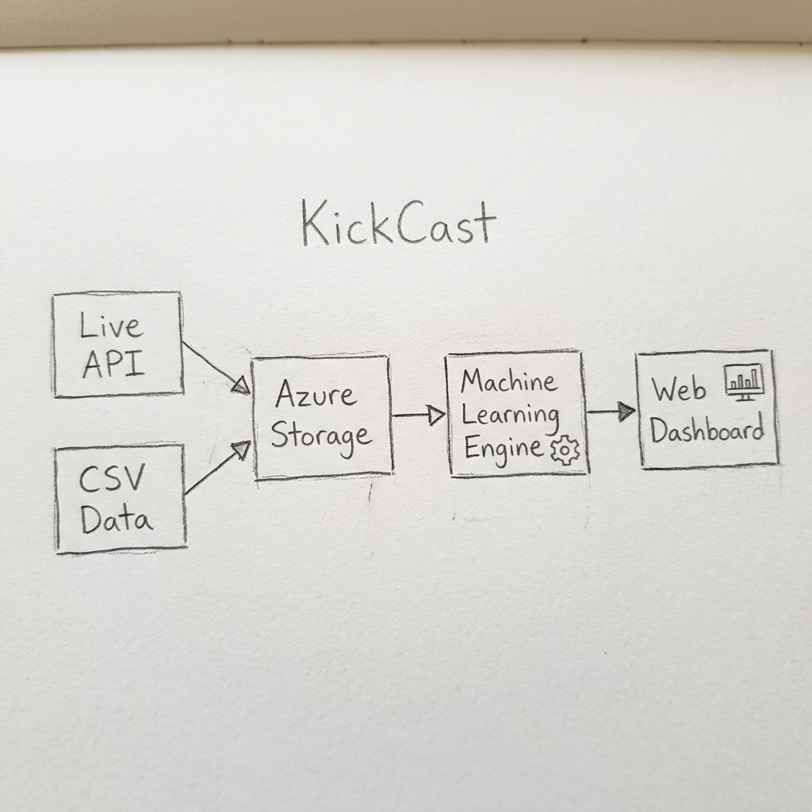

# KickCast 

Hey there! Welcome to KickCast. This is a project we built to predict the outcomes of the 2026 FIFA World Cup matches in real-time. It takes in live match schedules, looks at over 150 years of historical football data, and uses machine learning to guess who will win, what the exact score will be, and even if the match will go to penalties! 

Then, it displays all these predictions on a nice web dashboard.




---

## How It All Fits Together (Architecture)

Here is a diagram showing how the different parts of the project talk to each other:



### The Main Pieces:
1. **Data Layer (`data/`)**: This part talks to the internet to download the live World Cup schedule and also loads a massive CSV file full of past football results.
2. **Machine Learning Engine (`model/`)**: This is the brain. It calculates team strengths, looks at recent form, and makes the actual predictions.
3. **Automation Scripts (`scripts/`)**: These are just some python files we run to actually stitch everything together (like downloading the data, running the model, and saving the results).
4. **Web Dashboard (`web/`)**: This is the frontend website you actually see on your screen.

---

## Deep Dive: The Machine Learning Engine & Pipelines

We are actually running a few different models under the hood to figure out exactly what might happen in a match. We also have an automated pipeline that carefully trains and tests the model. Here is the breakdown:

### 1. The Data Pipeline (How We Train It)
Before the model can predict the future, it needs to learn from the past. Our training pipeline (`scripts/train_model.py`) does this very carefully:
- **Chronological Splitting:** We don't just randomly test the model. We train it on matches that happened *before* June 2024, and then test its accuracy strictly on matches from June 2024 onwards. This proves the model can actually predict the future without cheating!
- **Time Decay Weights:** A match played in 2024 is much more relevant than a match played in 1930. Our pipeline mathematically tells the model to pay more attention to recent matches (with a "half-life" of 5 years).

### 2. The Team Strength Model (Elo Ratings)
Before we can predict a match, we need to know how good a team is. We use an **Elo Rating System**. 
- Every team starts with a basic score of 1500 points.
- If you win a match, you steal points from the team you beat.
- If you beat a really strong team, you steal *a lot* of points. By running this math over every single international football match since the 1870s, we get a really accurate, up-to-date power ranking for every country today!

### 3. The Match Outcome Model (Gradient Boosting)
Now that we know how strong the teams are, we want to guess who will win. We use a powerful machine learning model called a **Gradient Boosting Classifier**. 
In simple terms, this model builds hundreds of tiny "decision trees" that all vote on the outcome. Instead of just looking at the Elo ratings, we feed the model 22 different clues (features) for every match. Some of these clues include:
- What is the Elo rating difference between the two teams?
- How many points did each team earn in their last 5 matches? (Recent form)
- Are they on a winning streak? How many clean sheets have they kept?
- Is this a knockout match? (Teams play differently when they might get eliminated).
- Who usually wins when these two specific teams play each other? (Head-to-head history).

The model looks at all these clues, combines the votes of its decision trees, and spits out a percentage probability for three outcomes: Home Win, Draw, or Away Win. We even "calibrate" the model so that if it says a team has a 60% chance of winning, they actually win exactly 60% of the time in real life!

### 4. The Exact Score Model
It's cool to know who will win, but we also want to guess the exact score (like 2-1 or 0-0). 
To do this, we use a separate mathematical model called **Poisson Regression**. In football, goals happen somewhat randomly but around a certain average. This model predicts exactly how many goals the home team will score and how many the away team will score based on their attack strength and the opponent's defense weakness.

### 5. Extra Time and Penalties
For the group stages, a draw is just a draw. But in the knockout stages, someone *has* to win!
If our Outcome Model predicts the match will be really close and likely end in a draw after 90 minutes, we have extra logic that figures out what happens next. It splits the draw probability and guesses who will survive Extra Time, or if it goes all the way to a Penalty Shootout, it picks a winner based on who has the higher Elo rating.

---

## Model Accuracy (How Good Is It?)

We measure the model's performance on a strict hold-out test set (matches from June 2024 to present) that it has never seen before. 

- **Accuracy (60.3%):** Football is a notoriously unpredictable and low-scoring game. Even the best betting markets only guess the exact outcome (Win/Draw/Loss) around 55-60% of the time. Our model hits 60.3% accuracy, proving it is highly competitive and captures the true dynamics of the game better than just guessing based on team popularity.
- **Log Loss (0.865):** This measures how heavily the model is penalized for being extremely wrong. A lower score is better! Our score of 0.865 shows that when an upset happens, the model usually wasn't blindly guaranteeing the favorite would win—it understands risk and uncertainty.
- **Brier Score (0.508):** This measures how *confident* the model is when it gets things right or wrong. For example, if it says Brazil has a 90% chance to win and they do, it gets a great Brier score. Our low score here proves that the probabilities you see on the dashboard are highly trustworthy and mathematically sound.

---

## How to Run It Locally

If you want to run this on your own computer, just follow these steps:

### 1. What you need
- Python installed on your computer.
- Node.js installed (so we can run a local database emulator called Azurite).
- A free API key from [football-data.org](https://www.football-data.org/).

### 2. Set it up
Open your terminal and install the python packages:
```bash
python3 -m venv .venv
source .venv/bin/activate
pip install -r requirements.txt
```

Create a file named `.env` and put your API key inside it (you can copy `.env.example`).

### 3. Start the Database
We use Azurite to pretend we are talking to a real cloud database. Open a new terminal window and run:
```bash
npx azurite --location ./azurite_data
```

### 4. Train the Model and Get Predictions
Run these scripts to download the schedule, train the AI on the historical data, and predict the upcoming matches:
```bash
python scripts/bootstrap_data.py
python scripts/train_model.py
python scripts/run_pipeline.py
```

### 5. Start the Website!
Finally, start the web server to see the dashboard:
```bash
python web/server.py
```
Open your browser and go to **http://localhost:8080**.

---

## Putting it on the Internet (Azure)

If you want to host this so your friends can see it, it is built to run on Azure Cloud!
- **Database:** You can create an Azure Storage Account and save the predictions there instead of your local computer.
- **Automation:** You can put the `run_pipeline.py` script inside an Azure Function so it automatically runs every hour to keep the predictions fresh.
- **Website:** You can host the `web/` folder using Azure App Service so anyone with a link can view your dashboard.
